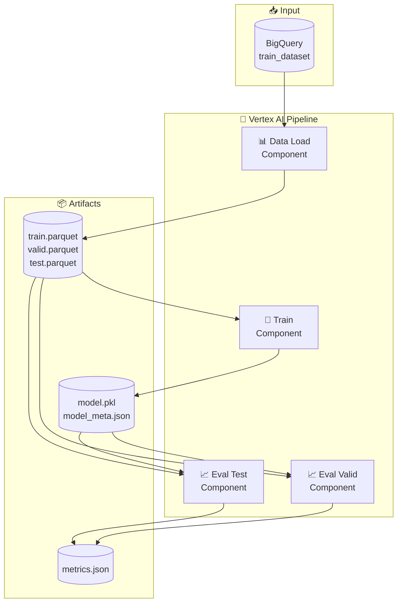
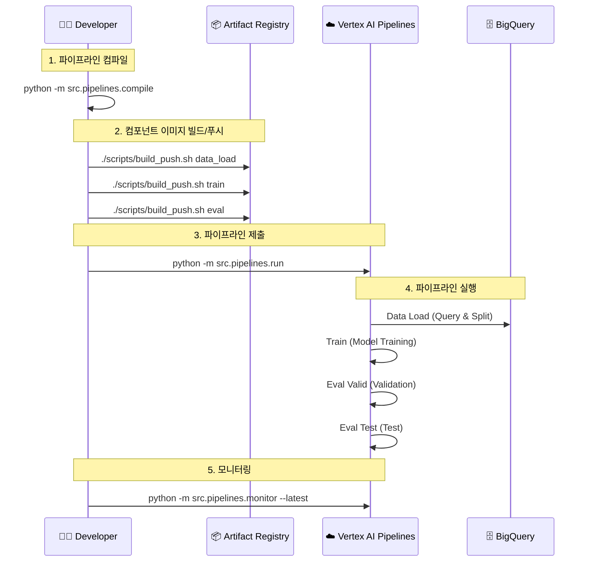

# VertexAI Pipeline 프로세스 문서

## 1. 전체 파이프라인 아키텍처

### 개요
Customer Churn 예측 모델 학습을 위한 End-to-End ML 파이프라인입니다.
컨테이너 기반 컴포넌트로 구성되어 Vertex AI Pipelines에서 실행됩니다.

### 아키텍처 다이어그램



---

## 2. 컴포넌트 상세

### 2.1 Data Load Component

| 항목 | 내용 |
|------|------|
| **이미지** | `asia-northeast3-docker.pkg.dev/{PROJECT}/vertex-ai-pipelines/component-data_load:latest` |
| **입력** | BigQuery 테이블 경로, 라벨 컬럼, 시간 컬럼, split 비율 |
| **출력** | `train.parquet`, `valid.parquet`, `test.parquet` |
| **기능** | BigQuery에서 데이터 로드 후 시간 기준 train/valid/test 분할 |

**파라미터:**
- `input_bq_table`: BigQuery 테이블 경로 (예: `project.dataset.table`)
- `label_column`: 라벨 컬럼명 (예: `label_churn_60d`)
- `time_column`: 시간 기준 분할 컬럼 (예: `label_timestamp`)
- `train_ratio`: 학습 데이터 비율 (기본: 0.7)
- `valid_ratio`: 검증 데이터 비율 (기본: 0.15)

### 2.2 Train Component

| 항목 | 내용 |
|------|------|
| **이미지** | `asia-northeast3-docker.pkg.dev/{PROJECT}/vertex-ai-pipelines/component-train:latest` |
| **입력** | Dataset artifacts, Feature 컬럼 목록, 모델 하이퍼파라미터 |
| **출력** | `model.pkl`, `model_meta.json` |
| **기능** | 분류 모델 학습 (RandomForest / LogisticRegression) |

**파라미터:**
- `feature_columns`: 피처 컬럼 목록 (콤마 구분)
- `label_column`: 라벨 컬럼명
- `model_type`: 모델 유형 (`random_forest` / `logistic_regression`)
- `n_estimators`: 트리 개수 (RandomForest, 기본: 100)
- `max_depth`: 최대 깊이 (기본: 10)
- `random_state`: 랜덤 시드 (기본: 42)

**사용 피처:**
```
orders_30d, orders_90d, revenue_30d, revenue_90d,
avg_order_value_90d, distinct_products_90d,
distinct_categories_90d, days_since_last_order
```

### 2.3 Eval Component

| 항목 | 내용 |
|------|------|
| **이미지** | `asia-northeast3-docker.pkg.dev/{PROJECT}/vertex-ai-pipelines/component-eval:latest` |
| **입력** | Model artifact, Dataset artifact, 평가 대상 split |
| **출력** | `metrics.json` |
| **기능** | 모델 성능 평가 (ROC-AUC, PR-AUC, Accuracy, Positive Rate) |

**파라미터:**
- `eval_split`: 평가 대상 (`valid` / `test`)

**출력 메트릭:**
- `roc_auc`: ROC-AUC 점수
- `pr_auc`: PR-AUC 점수
- `accuracy`: 정확도
- `positive_rate`: 양성 비율

---

## 3. 실행 워크플로우

### Sequence Diagram



### 실행 명령어

```bash
# Step 1: 파이프라인 컴파일
python -m src.pipelines.compile

# Step 2: 컴포넌트 이미지 빌드 및 푸시
./scripts/build_push.sh data_load
./scripts/build_push.sh train
./scripts/build_push.sh eval
# 또는 전체 빌드: ./scripts/build_push_all.sh

# Step 3: 파이프라인 제출
python -m src.pipelines.run

# Step 4: 실행 모니터링
python -m src.pipelines.monitor --latest
```

---

## 4. 디렉토리 구조

```
src/
├── components/                 # 파이프라인 컴포넌트
│   ├── _template/              # 컴포넌트 템플릿
│   │   ├── Dockerfile
│   │   └── src/main.py
│   ├── data_load/              # 데이터 로드 컴포넌트
│   │   ├── Dockerfile
│   │   └── src/main.py
│   ├── train/                  # 학습 컴포넌트
│   │   ├── Dockerfile
│   │   └── src/main.py
│   └── eval/                   # 평가 컴포넌트
│       ├── Dockerfile
│       └── src/main.py
└── pipelines/                  # 파이프라인 정의
    ├── pipeline.py             # 파이프라인 정의 (KFP)
    ├── compile.py              # JSON 컴파일러
    ├── run.py                  # Vertex AI 제출
    └── monitor.py              # 실행 상태 모니터링

scripts/
├── build_push.sh               # 단일 컴포넌트 빌드/푸시
├── build_push_all.sh           # 전체 컴포넌트 빌드/푸시
└── smoke_test.sh               # 로컬 검증
```

---

## 5. 파이프라인 파라미터

| 파라미터 | 기본값 | 설명 |
|---------|--------|------|
| `input_bq_table` | `{project}.featurestore_demo.train_dataset` | 학습 데이터 테이블 |
| `label_column` | `label_churn_60d` | 라벨 컬럼 |
| `time_column` | `label_timestamp` | 시간 분할 기준 컬럼 |
| `train_ratio` | `0.7` | 학습 데이터 비율 |
| `valid_ratio` | `0.15` | 검증 데이터 비율 |
| `model_type` | `random_forest` | 모델 유형 |
| `n_estimators` | `100` | 트리 개수 |
| `max_depth` | `10` | 최대 트리 깊이 |
| `random_state` | `42` | 랜덤 시드 |

---

## 6. 모니터링

### Monitor 명령어

```bash
# 최신 파이프라인 모니터링
python -m src.pipelines.monitor --latest

# 특정 Job 모니터링
python -m src.pipelines.monitor <job_name>
python -m src.pipelines.monitor customer-churn-training-pipeline-20260130085524

# 옵션
--interval 10     # 폴링 간격 (초)
--no-color        # 컬러 출력 비활성화
```

### 상태 표시

| 상태 | 색상 | 설명 |
|------|------|------|
| `PENDING` | 🟡 Yellow | 대기 중 |
| `RUNNING` | 🔵 Cyan | 실행 중 |
| `SUCCEEDED` | 🟢 Green | 성공 |
| `FAILED` | 🔴 Red | 실패 |
| `CANCELLED` | 🟣 Magenta | 취소됨 |

---

## 7. 환경 설정

### 환경 변수 (build_push.sh)

| 변수 | 기본값 | 설명 |
|------|--------|------|
| `PROJECT_ID` | `heum-alfred-evidence-clf-dev` | GCP 프로젝트 ID |
| `REGION` | `asia-northeast3` | GCP 리전 |
| `REPOSITORY` | `vertex-ai-pipelines` | Artifact Registry 저장소 |
| `IMAGE_TAG` | Git SHA | 이미지 태그 |

### 설정 파일

`configs/env.yaml` 파일에서 GCP 프로젝트, 리전, BigQuery 테이블 등을 설정합니다.

---

## 8. 트러블슈팅

### 일반적인 문제

**1. 이미지 빌드 실패**
```bash
# Docker 인증 확인
gcloud auth configure-docker asia-northeast3-docker.pkg.dev
```

**2. 파이프라인 제출 실패**
```bash
# 컴파일 파일 확인
ls src/pipelines/compiled/

# 권한 확인
gcloud projects get-iam-policy <PROJECT_ID>
```

**3. 데이터 로드 실패**
```bash
# BigQuery 테이블 확인
bq show <project>.<dataset>.<table>
```

---

*Last Updated: 2026-01-30*
