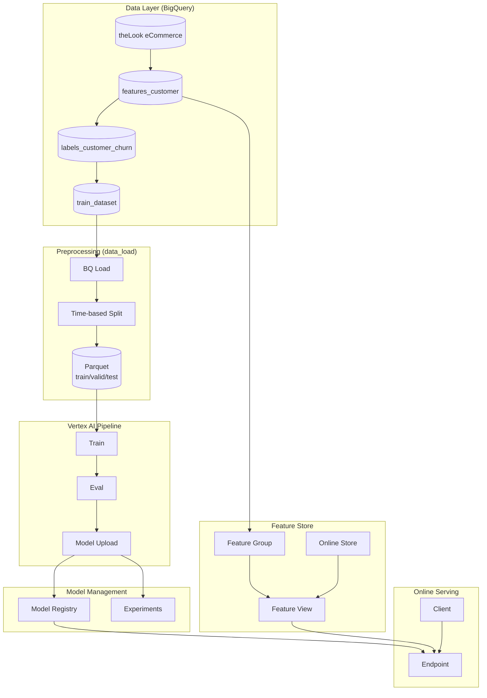
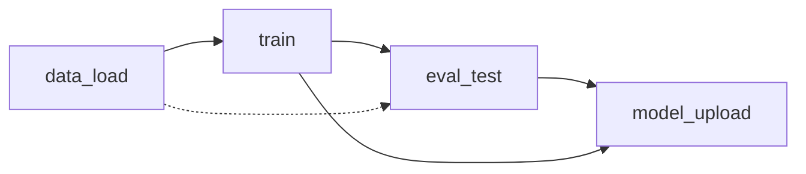
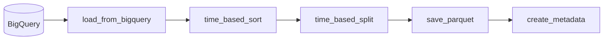
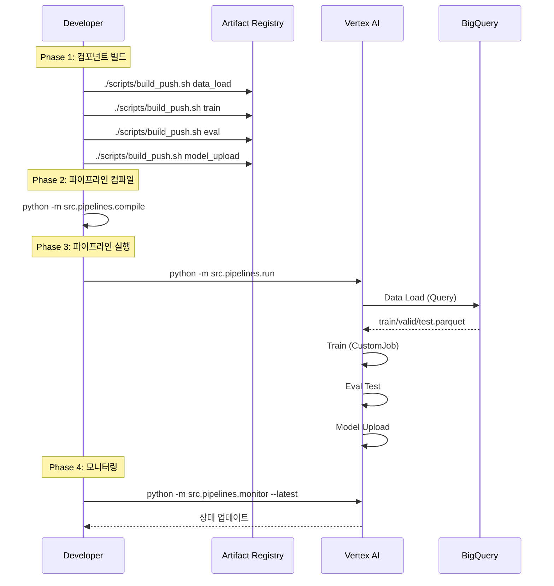
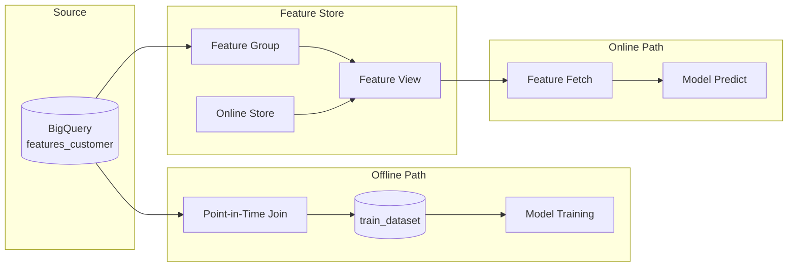
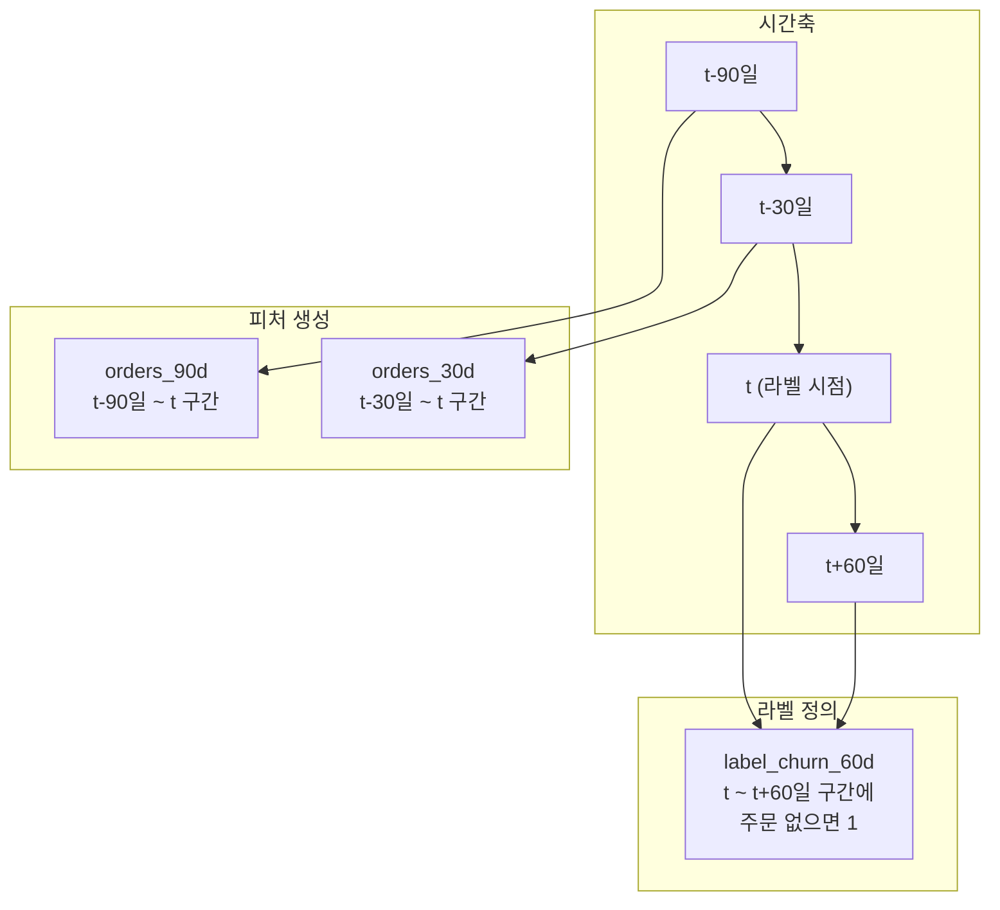
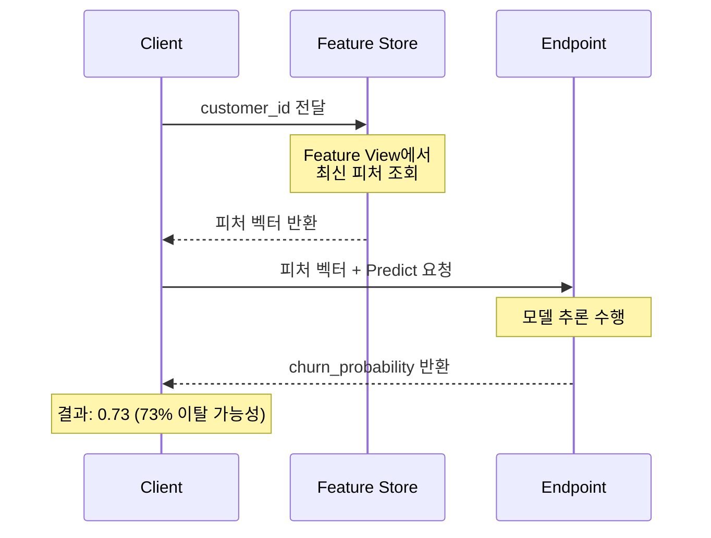

# MLOps Pipeline 프로세스 가이드

Vertex AI Pipeline을 활용한 Customer Churn 예측 모델의 End-to-End ML 파이프라인 설계 문서입니다.

---

## 1. 개요 (Overview)

### 프로젝트 목적

- **목표**: 고객 이탈 예측 (Customer Churn Prediction)
- **정의**: 기준 시점 이후 60일 동안 구매가 없는 고객을 이탈로 판정
- **대상**: theLook eCommerce 데이터셋

### 전체 아키텍처



> **핵심 가치**: Feature Store를 통해 학습(Offline)과 서빙(Online)에서 동일한 피처 정의를 사용하여 **학습-서빙 일관성**을 보장합니다.

---

## 2. 파이프라인 DAG (Pipeline Flow)

### 컴포넌트 의존성



### 실행 흐름

1. **data_load**: BigQuery에서 데이터를 로드하고 시간 기준 분할
2. **train**: CustomTrainingJob으로 모델 학습 (Vertex AI 학습 섹션에 표시)
3. **eval_test**: 테스트 세트에서 모델 평가
4. **model_upload**: Model Registry 업로드 + Experiments 로깅

### 컴포넌트 상세

| 컴포넌트 | 입력 | 출력 | 기능 |
|---------|------|------|------|
| **data_load** | BQ 테이블 경로, split 비율 | train/valid/test.parquet | 시간 기반 데이터 분할 |
| **train** | parquet 데이터셋 | model.pkl, model_meta.json | 모델 학습 (RandomForest/LogisticRegression) |
| **eval** | 모델 + 데이터셋 | metrics.json | 평가 (ROC-AUC, PR-AUC, Accuracy) |
| **model_upload** | 모델 + 메트릭 | Model Resource | Registry 등록 + Experiments 로깅 |

#### data_load 상세

**이미지**: `asia-northeast3-docker.pkg.dev/{PROJECT}/vertex-ai-pipelines/component-data_load:latest`

**전처리 단계 (Preprocessing Steps)**:



1. **`load_from_bigquery()`**: BigQuery에서 전체 데이터 로드
2. **`time_based_split()`**: 시간 컬럼(`label_timestamp`) 기준 정렬 후 Train(70%)/Valid(15%)/Test(15%) 분할
3. **`save_parquet()`**: 각 분할 데이터를 Parquet 포맷으로 저장
4. **`create_metadata()`**: 라벨 분포(`positive_rate`), 시간 범위 등 메타데이터 생성

> **중요**: 시간 기반 분할은 데이터 누수(data leakage)를 방지하고, 학습/검증/테스트 세트 간 시간적 일관성을 보장합니다.

**파라미터**:
- `input_bq_table`: BigQuery 테이블 경로
- `label_column`: 라벨 컬럼 (기본: `label_churn_60d`)
- `time_column`: 시간 분할 기준 (기본: `label_timestamp`)
- `train_ratio`: 학습 비율 (기본: 0.7)
- `valid_ratio`: 검증 비율 (기본: 0.15)

#### train 상세

**이미지**: `asia-northeast3-docker.pkg.dev/{PROJECT}/vertex-ai-pipelines/component-train:latest`

**특징**: `CustomTrainingJob`으로 래핑되어 Vertex AI 콘솔 > 학습 섹션에서 확인 가능

**피처 컬럼**:
```
orders_30d, orders_90d, revenue_30d, revenue_90d,
avg_order_value_90d, distinct_products_90d,
distinct_categories_90d, days_since_last_order
```

#### eval 상세

**이미지**: `asia-northeast3-docker.pkg.dev/{PROJECT}/vertex-ai-pipelines/component-eval:latest`

**출력 메트릭**:
- `roc_auc`: ROC-AUC 점수
- `pr_auc`: PR-AUC 점수
- `accuracy`: 정확도
- `positive_rate`: 양성 비율 (라벨 분포 확인용)

#### model_upload 상세

**이미지**: `asia-northeast3-docker.pkg.dev/{PROJECT}/vertex-ai-pipelines/component-model_upload:latest`

**기능**:
- Vertex AI Model Registry에 모델 등록
- Vertex AI Experiments에 메트릭 로깅
- 파이프라인 아티팩트 경로 직접 사용 (별도 GCS 업로드 불필요)

### 실행 워크플로우



---

## 3. Feature Store 통합

### Feature Store Dual-Layer 아키텍처 (업계 표준)

Feature Store는 **Offline Store**(BigQuery)와 **Online Store**(Bigtable)로 분리되는 Dual-Layer 아키텍처가 업계 표준입니다.

| 요구사항 | Offline Store | Online Store |
|---------|---------------|--------------|
| 지연시간 | 분~시간 (OK) | <10ms (필수) |
| 데이터 범위 | 전체 이력 (TB급) | 최신값만 (GB급) |
| 용도 | 학습 데이터 생성 | 실시간 추론 |
| 쿼리 패턴 | 대량 스캔 | 단일 키 조회 |

> **Google Cloud 공식**: *"BigQuery can now be an organization's offline store, letting enterprises bring the feature store experience to existing BigQuery infrastructure, avoid data duplication, and save on costs."*

**참고 자료**:
- [Vertex AI Feature Store (Google Cloud)](https://cloud.google.com/blog/products/ai-machine-learning/new-vertex-ai-feature-store-bigquery-powered-genai-ready)
- [Feature Store Architecture](https://www.dragonflydb.io/blog/feature-store-architecture-and-storage)

### Offline vs Online 서빙 경로



### 업계 주요 Feature Store 비교

| Feature Store | Offline Store | Online Store | 특징 |
|---------------|---------------|--------------|------|
| **Vertex AI** | BigQuery | Bigtable | GCP 네이티브, BigQuery SQL 활용 |
| **Feast** | BigQuery/S3/Snowflake | Redis/DynamoDB | 오픈소스, 유연한 백엔드 |
| **Tecton** | S3/Snowflake | DynamoDB/Redis | 관리형, 스트리밍 지원 |
| **Databricks** | Delta Lake | Delta Lake | 단일 스토어, Lakehouse |

### Feature View Sync 메커니즘

**Sync 전략**: Scheduled Sync (서울 리전에서 continuous sync 제약 고려)

1. Feature Group이 BigQuery 소스 테이블과 연결
2. Feature View가 Feature Group 기반으로 생성
3. Scheduled Sync가 Online Store에 최신 피처 동기화
4. 온라인 요청 시 Online Store에서 저지연 조회

> **주의**: 데모 실행 시 최초 sync 완료 확인 필수 (상태 polling 로직 포함)

### Point-in-Time Join (데이터 누수 방지)

#### 개념



#### Point-in-Time Join 규칙

```sql
-- 핵심 조건: 피처 시점 <= 라벨 시점 (누수 방지)
WHERE f.feature_timestamp <= l.label_timestamp
```

**작동 방식**:
1. 라벨 테이블의 각 `(customer_id, label_timestamp)` 조합에 대해
2. 피처 테이블에서 `feature_timestamp <= label_timestamp` 조건 충족하는 행 중
3. 가장 최신(MAX) 피처 스냅샷을 조인

> **중요**: `label_timestamp` spine은 `CURRENT_DATE()` 기반이 아닌 **주문 데이터 범위 기반**으로 생성 (라벨 편향 방지)

### 온라인 서빙 흐름



### 온라인 예측 코드 흐름

```python
# 1. Feature Store에서 피처 조회
features = fetch_features(
    project_id=project_id,
    online_store_name="churn_online_store",
    feature_view_name="customer_features_view",
    entity_id=customer_id,
    feature_names=FEATURE_COLUMNS
)

# 2. 예측 입력 준비
instance = [features[col] for col in FEATURE_COLUMNS]

# 3. Endpoint 예측 호출
response = endpoint.predict(instances=[instance])
churn_probability = response.predictions[0][1]
```

---

## 4. 디렉토리 구조

```
src/
├── components/              # 파이프라인 컴포넌트
│   ├── _template/           # 컴포넌트 템플릿
│   ├── data_load/           # 데이터 로드
│   ├── train/               # 모델 학습
│   ├── eval/                # 모델 평가
│   └── model_upload/        # 모델 업로드
├── pipelines/               # 파이프라인 정의
│   ├── pipeline.py          # 파이프라인 DAG
│   ├── compile.py           # JSON 컴파일러
│   ├── run.py               # Vertex AI 제출
│   └── monitor.py           # 상태 모니터링
├── data/                    # SQL 스크립트
├── featurestore/            # Feature Store 관리
└── serving/                 # 온라인 서빙

scripts/
├── build_push.sh            # 단일 컴포넌트 빌드/푸시
├── build_push_all.sh        # 전체 빌드/푸시
└── smoke_test.sh            # 로컬 검증
```

---

## 5. 파이프라인 파라미터

| 파라미터 | 기본값 | 설명 |
|---------|--------|------|
| `input_bq_table` | `{project}.featurestore_demo.train_dataset` | 학습 데이터 테이블 |
| `label_column` | `label_churn_60d` | 라벨 컬럼 |
| `time_column` | `label_timestamp` | 시간 분할 기준 |
| `train_ratio` | `0.7` | 학습 데이터 비율 |
| `valid_ratio` | `0.15` | 검증 데이터 비율 |
| `model_type` | `random_forest` | 모델 유형 |
| `n_estimators` | `100` | 트리 개수 |
| `max_depth` | `10` | 최대 트리 깊이 |
| `experiment_name` | `churn-experiment` | Experiments 이름 |
| `model_display_name` | `churn-model` | Model Registry 표시 이름 |

---

## 6. 실행 명령어

```bash
# Step 1: 컴포넌트 이미지 빌드 및 푸시
./scripts/build_push.sh data_load
./scripts/build_push.sh train
./scripts/build_push.sh eval
./scripts/build_push.sh model_upload
# 또는 전체 빌드: ./scripts/build_push_all.sh

# Step 2: 파이프라인 컴파일
python -m src.pipelines.compile

# Step 3: 파이프라인 제출
python -m src.pipelines.run

# Step 4: 실행 모니터링
python -m src.pipelines.monitor --latest
```

---

## 7. 모니터링

### Monitor 명령어

```bash
# 최신 파이프라인 모니터링
python -m src.pipelines.monitor --latest

# 특정 Job 모니터링
python -m src.pipelines.monitor <job_name>
python -m src.pipelines.monitor customer-churn-training-pipeline-20260130085524

# 옵션
--interval 10     # 폴링 간격 (초)
--no-color        # 컬러 출력 비활성화
```

### 상태 표시

| 상태 | 설명 |
|------|------|
| `PENDING` | 대기 중 |
| `RUNNING` | 실행 중 |
| `SUCCEEDED` | 성공 |
| `FAILED` | 실패 |
| `CANCELLED` | 취소됨 |

---

## 8. 환경 설정

### 환경 변수 (build_push.sh)

| 변수 | 기본값 | 설명 |
|------|--------|------|
| `PROJECT_ID` | `heum-alfred-evidence-clf-dev` | GCP 프로젝트 ID |
| `REGION` | `asia-northeast3` | GCP 리전 |
| `REPOSITORY` | `vertex-ai-pipelines` | Artifact Registry 저장소 |
| `IMAGE_TAG` | Git SHA | 이미지 태그 |

### 설정 파일

`configs/env.yaml` 파일에서 GCP 프로젝트, 리전, BigQuery 테이블 등을 설정합니다.

---

## 9. 트러블슈팅

### 일반적인 문제

**1. 이미지 빌드 실패**
```bash
# Docker 인증 확인
gcloud auth configure-docker asia-northeast3-docker.pkg.dev
```

**2. 파이프라인 제출 실패**
```bash
# 컴파일 파일 확인
ls src/pipelines/compiled/

# 권한 확인
gcloud projects get-iam-policy <PROJECT_ID>
```

**3. 데이터 로드 실패**
```bash
# BigQuery 테이블 확인
bq show <project>.<dataset>.<table>
```

---

*Last Updated: 2026-01-30*
